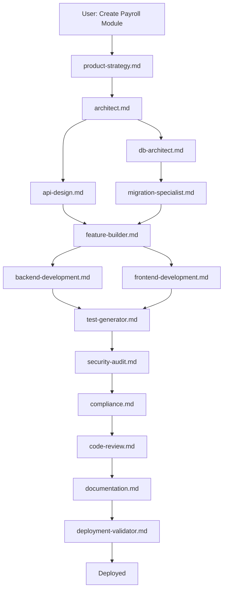
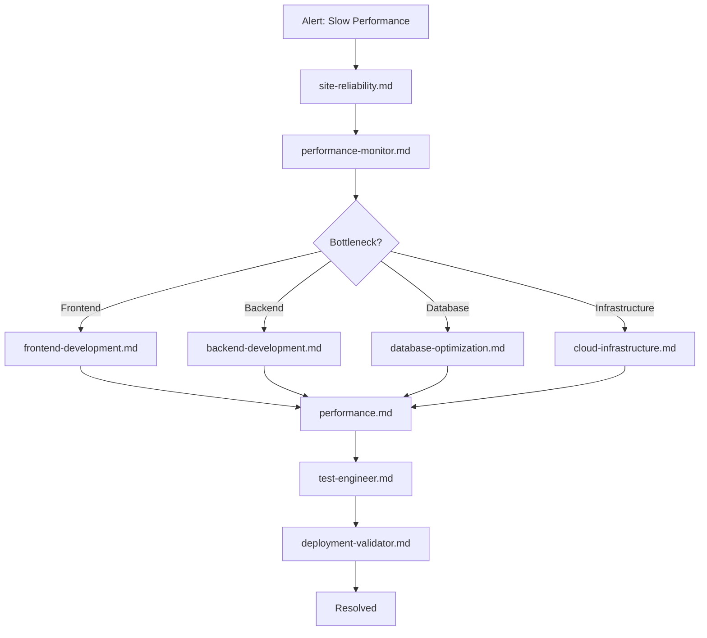

# Agent Orchestration Guide

This document defines how multiple AI agents work together in the Nexus HR system to accomplish complex, multi-domain tasks.

## Overview

The Nexus HR agent framework consists of 34+ specialized agents organized into 9 domains. This orchestration guide explains how to coordinate these agents effectively.

## Agent Domains

### 1. Architecture & Design (5 agents)
- **architect.md** - System architecture and design patterns
- **system-design.md** - Scalability and distributed systems
- **api-design.md** - RESTful API design and standards
- **db-architect.md** - Database architecture and modeling
- **migration-specialist.md** - Data migration strategies

### 2. Development (4 agents)
- **frontend-development.md** - React/TypeScript frontend
- **backend-development.md** - Node.js/Express backend
- **feature-builder.md** - End-to-end feature implementation
- **tech-lead.md** - Technical leadership and coordination

### 3. Quality & Testing (7 agents)
- **test-generator.md** - Automated test generation
- **test-engineer.md** - Testing strategy and frameworks
- **testing.md** - Test planning and execution
- **code-quality.md** - Code quality standards
- **code-review.md** - Code review automation
- **code-reviewer.md** - In-depth code analysis
- **auditor.md** - Compliance and quality audits

### 4. Security & Compliance (3 agents)
- **security-audit.md** - Security vulnerability scanning
- **application-security.md** - Application-level security
- **security.md** - Security best practices
- **compliance.md** - Regulatory compliance (GDPR, etc.)

### 5. Infrastructure & Operations (4 agents)
- **devops.md** - CI/CD and automation
- **cloud-infrastructure.md** - Cloud deployment (AWS/Azure/GCP)
- **site-reliability.md** - SRE practices and monitoring
- **platform-integration.md** - Third-party integrations

### 6. Performance & Data (4 agents)
- **performance-monitor.md** - Performance optimization
- **performance.md** - Performance analysis
- **database-optimization.md** - Database query optimization
- **data-pipeline.md** - ETL and data processing
- **machine-learning.md** - ML/AI features

### 7. Documentation & Knowledge (2 agents)
- **api-documenter.md** - API documentation
- **documentation.md** - Technical documentation

### 8. Product & Strategy (4 agents)
- **product-strategy.md** - Product roadmap and planning
- **growth-strategy.md** - Growth and scaling
- **user-experience.md** - UX/UI design
- **customer-support.md** - Support and troubleshooting

### 9. Specialized Operations (2 agents)
- **deployment-validator.md** - Deployment validation
- **type-safety.md** - TypeScript improvements

## Orchestration Patterns

### Pattern 1: Sequential Workflow

For tasks requiring ordered execution:

```
User Request: "Implement employee performance review feature"

Step 1: architect.md
→ Design system architecture
→ Define data models
→ Plan API endpoints

Step 2: db-architect.md
→ Design database schema
→ Create Prisma models
→ Plan migrations

Step 3: api-design.md
→ Design REST API
→ Define request/response schemas
→ Document endpoints

Step 4: feature-builder.md
→ Implement backend controllers
→ Implement frontend components
→ Wire up integration

Step 5: test-generator.md
→ Generate unit tests
→ Generate integration tests
→ Create E2E tests

Step 6: code-review.md
→ Review implementation
→ Check best practices
→ Verify security

Step 7: documentation.md
→ Write technical docs
→ Update user guide
→ Create examples
```

### Pattern 2: Parallel Execution

For independent tasks that can run simultaneously:

```
User Request: "Optimize application performance"

Parallel Tasks:
├─ frontend-development.md
│  └─ Optimize React components
│     - Reduce re-renders
│     - Code splitting
│     - Lazy loading
│
├─ backend-development.md
│  └─ Optimize API endpoints
│     - Response time
│     - Caching
│     - Compression
│
├─ database-optimization.md
│  └─ Optimize queries
│     - Add indexes
│     - Query optimization
│     - Connection pooling
│
└─ performance.md
   └─ Analyze metrics
      - Bundle size
      - Load time
      - API latency

Final: performance-monitor.md
→ Aggregate results
→ Generate report
→ Recommend next steps
```

### Pattern 3: Collaborative Review

For code quality and security:

```
User Request: "Review pull request #123"

Layer 1: Automated Checks
├─ test-engineer.md → Verify test coverage
├─ code-quality.md → Check coding standards
└─ type-safety.md → Validate TypeScript

Layer 2: Security Review
├─ security-audit.md → Scan for vulnerabilities
├─ application-security.md → Check auth/authz
└─ compliance.md → Verify GDPR compliance

Layer 3: Architecture Review
├─ architect.md → Validate design patterns
├─ system-design.md → Check scalability
└─ api-design.md → Review API changes

Layer 4: Final Review
└─ code-reviewer.md → Comprehensive analysis
   → Aggregate all findings
   → Prioritize issues
   → Recommend approval/changes
```

### Pattern 4: Feature Development Lifecycle

Complete feature implementation:

```
Phase 1: Planning
product-strategy.md → Define requirements
user-experience.md → Design UX/UI
architect.md → Plan architecture

Phase 2: Design
api-design.md → Design API
db-architect.md → Design schema
system-design.md → Plan scalability

Phase 3: Implementation
backend-development.md → Build API
frontend-development.md → Build UI
feature-builder.md → Integrate

Phase 4: Quality
test-generator.md → Generate tests
test-engineer.md → Review test strategy
code-review.md → Review code

Phase 5: Security
security-audit.md → Security scan
application-security.md → Security review
compliance.md → Compliance check

Phase 6: Deployment
devops.md → Setup CI/CD
deployment-validator.md → Pre-flight checks
site-reliability.md → Monitoring setup

Phase 7: Documentation
api-documenter.md → API docs
documentation.md → Technical docs
customer-support.md → User guide
```

### Pattern 5: Crisis Response

For production issues:

```
Alert: "Production API response time > 5s"

Immediate Response (Parallel):
├─ site-reliability.md → Check system health
├─ performance-monitor.md → Identify bottleneck
└─ devops.md → Check infrastructure

Analysis:
└─ If database issue:
   └─ database-optimization.md
      → Analyze slow queries
      → Check indexes
      → Review connection pool

└─ If application issue:
   └─ performance.md
      → Profile application
      → Identify hot paths
      → Optimize code

└─ If infrastructure issue:
   └─ cloud-infrastructure.md
      → Check resource limits
      → Scale if needed
      → Review configuration

Resolution:
└─ backend-development.md → Implement fix
└─ test-engineer.md → Verify fix
└─ deployment-validator.md → Deploy fix
└─ site-reliability.md → Monitor recovery
```

## Agent Communication Protocol

### Request Format

```json
{
  "task": "Implement employee leave management",
  "context": {
    "module": "leave",
    "priority": "high",
    "deadline": "2025-12-01"
  },
  "previous_agents": [
    {
      "agent": "architect.md",
      "output": "Architecture design complete",
      "artifacts": ["docs/leave-architecture.md"]
    }
  ],
  "constraints": {
    "no_breaking_changes": true,
    "test_coverage": "90%",
    "security_audit_required": true
  }
}
```

### Response Format

```json
{
  "agent": "backend-development.md",
  "status": "completed",
  "output": "Leave API endpoints implemented",
  "artifacts": [
    "server/src/controllers/leaveController.ts",
    "server/src/routes/leaveRoutes.ts",
    "server/src/validators/leaveValidator.ts"
  ],
  "next_agents": [
    "test-generator.md",
    "api-documenter.md"
  ],
  "blockers": [],
  "notes": "Used existing RBAC middleware"
}
```

## Coordination Rules

### Rule 1: Domain Experts First
Always consult domain expert agents before implementation:
- Architecture changes → architect.md
- Database changes → db-architect.md
- Security concerns → security-audit.md
- Performance issues → performance.md

### Rule 2: Security at Every Stage
Security agents must review:
- New features (application-security.md)
- API changes (security-audit.md)
- Data handling (compliance.md)

### Rule 3: Testing is Mandatory
Testing agents must validate:
- New code (test-generator.md)
- Test strategy (test-engineer.md)
- Test coverage (testing.md)

### Rule 4: Documentation is Concurrent
Documentation agents work in parallel:
- API changes → api-documenter.md
- Features → documentation.md
- User-facing → customer-support.md

### Rule 5: Review Before Deploy
Pre-deployment agent chain:
- code-review.md → security-audit.md → deployment-validator.md

## Agent Selection Guide

### When to use which agent?

**New Feature Request:**
1. product-strategy.md (requirements)
2. architect.md (design)
3. feature-builder.md (implementation)

**Bug Fix:**
1. auditor.md (root cause analysis)
2. backend-development.md or frontend-development.md (fix)
3. test-generator.md (regression test)

**Performance Issue:**
1. performance-monitor.md (diagnosis)
2. performance.md (analysis)
3. Specialist agent (database-optimization.md, frontend-development.md, etc.)

**Security Vulnerability:**
1. security-audit.md (scan)
2. application-security.md (fix)
3. compliance.md (verify compliance)

**Database Change:**
1. db-architect.md (design)
2. migration-specialist.md (migration strategy)
3. database-optimization.md (optimize)

**Deployment:**
1. devops.md (CI/CD setup)
2. deployment-validator.md (validation)
3. site-reliability.md (monitoring)

**Integration:**
1. platform-integration.md (design)
2. api-design.md (interface)
3. feature-builder.md (implement)

**Documentation:**
1. documentation.md (technical docs)
2. api-documenter.md (API reference)
3. customer-support.md (user guide)

## Multi-Agent Workflows

### Workflow: New Module Development



### Workflow: Performance Optimization



## Best Practices

### 1. Clear Handoffs
Each agent should produce clear artifacts for the next agent:
- Architecture diagrams
- API specifications
- Test plans
- Implementation code

### 2. Context Preservation
Pass all relevant context between agents:
- Previous decisions
- Constraints
- Existing implementations
- Known issues

### 3. Incremental Progress
Break large tasks into smaller agent-sized chunks:
- Each agent handles one domain
- Clear entry/exit criteria
- Measurable progress

### 4. Parallel When Possible
Identify independent tasks for parallel execution:
- Frontend + Backend development
- Multiple security scans
- Different documentation types

### 5. Quality Gates
Mandatory checkpoints:
- Architecture review before implementation
- Security scan before deployment
- Test coverage validation
- Code review approval

## Troubleshooting

### Issue: Conflicting Recommendations
**Solution:** Use tech-lead.md to arbitrate and make final decision

### Issue: Agent Blocked
**Solution:** Identify blocker, escalate to appropriate domain expert

### Issue: Circular Dependencies
**Solution:** Break into sequential phases, prioritize dependencies

### Issue: Missing Context
**Solution:** Use auditor.md to analyze and gather context

## Metrics & Monitoring

Track agent effectiveness:
- Task completion time
- Agent utilization
- Handoff delays
- Rework frequency
- Quality metrics (bugs, vulnerabilities)
- Documentation completeness

## Version History

- **v1.0.0** (2025-11-22): Initial orchestration framework
- 34+ specialized agents
- 9 domain categories
- 5 orchestration patterns

---

**Remember:** Agents are tools. The right orchestration creates value. Start simple, add complexity as needed.
