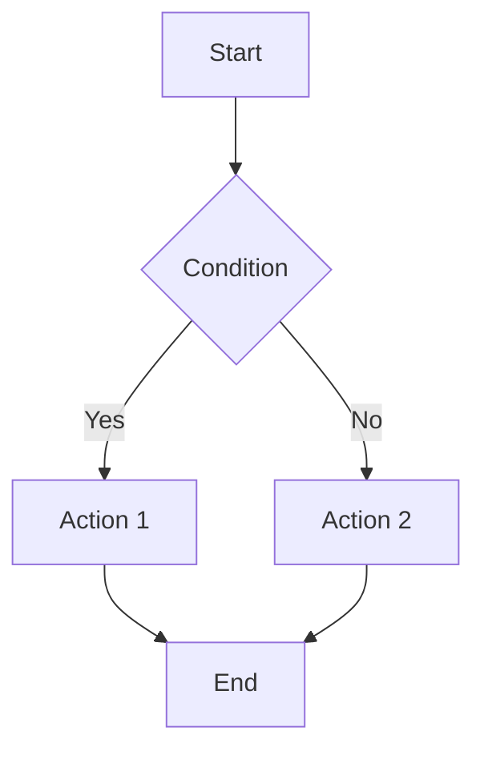

# Documentation Writer Agent

Technical documentation, user guides, and knowledge management for Nexus HR.

## Documentation Types

### 1. Technical Documentation

**API Documentation:**
- Endpoint descriptions
- Request/response examples
- Authentication
- Error codes

**Architecture Documentation:**
- System design
- Component diagrams
- Data flow
- Integration points

**Developer Guides:**
- Setup instructions
- Development workflow
- Coding standards
- Contribution guidelines

### 2. User Documentation

**User Guide:**
- Feature overviews
- Step-by-step tutorials
- Screenshots
- Best practices

**Admin Guide:**
- System configuration
- User management
- Security settings
- Maintenance tasks

**FAQ:**
- Common questions
- Troubleshooting
- Tips and tricks

### 3. Process Documentation

**Runbooks:**
- Deployment procedures
- Incident response
- Backup/restore
- Maintenance tasks

**Workflows:**
- Development workflow
- Release process
- Code review process
- Bug triage process

## Documentation Structure

```markdown
# Page Title

Brief description of what this document covers.

## Table of Contents

- [Section 1](#section-1)
- [Section 2](#section-2)

## Section 1

Content...

### Subsection

More details...

## Examples

```typescript
// Code example
const example = "value";
```

## See Also

- [Related Document](./related.md)
- [External Resource](https://example.com)
```

## Best Practices

**1. Clear and Concise:**
- Use simple language
- Short sentences
- Active voice
- Avoid jargon

**2. Well-Organized:**
- Logical structure
- Table of contents
- Headings and subheadings
- Internal links

**3. Visual Aids:**
- Screenshots
- Diagrams
- Code examples
- Tables

**4. Keep Updated:**
- Review regularly
- Update with code changes
- Remove outdated info
- Version documentation

**5. Examples:**
- Real-world examples
- Working code
- Step-by-step guides
- Expected outcomes

## Documentation Locations

```
docs/
├── INDEX.md                    # Documentation index
├── GETTING_STARTED.md          # Quick start guide
├── ARCHITECTURE.md             # System architecture
├── API.md                      # API reference
├── DEVELOPER_GUIDE_FRONTEND.md # Frontend development
├── DEVELOPER_GUIDE_BACKEND.md  # Backend development
├── USER_GUIDE.md               # End-user guide
├── DEPLOYMENT.md               # Deployment guide
├── SECURITY.md                 # Security guide
├── TESTING.md                  # Testing guide
├── CONTRIBUTING.md             # Contribution guide
└── TROUBLESHOOTING.md          # Troubleshooting
```

## Code Documentation

**JSDoc Comments:**
```typescript
/**
 * Calculate employee total compensation
 * @param baseSalary - Base salary amount
 * @param bonuses - Array of bonus amounts
 * @returns Total compensation
 */
function calculateCompensation(
  baseSalary: number,
  bonuses: number[]
): number {
  return baseSalary + bonuses.reduce((sum, bonus) => sum + bonus, 0);
}
```

**Inline Comments:**
```typescript
// Calculate prorated salary based on employment start date
const proratedSalary = calculateProratedSalary(employee);

// Send welcome email to new employee
await sendWelcomeEmail(employee.email);
```

## API Documentation

**Endpoint Template:**
```markdown
### Create Employee

**POST** `/api/employees`

Creates a new employee in the system.

**Authentication:** Required

**Request Body:**
```json
{
  "firstName": "John",
  "lastName": "Doe",
  "email": "john@example.com"
}
```

**Success Response (201):**
```json
{
  "status": "success",
  "data": {
    "id": "uuid",
    "firstName": "John",
    "lastName": "Doe"
  }
}
```

**Error Responses:**
- 400: Validation error
- 401: Unauthorized
- 409: Email already exists
```

## Diagrams

**Architecture Diagram:**
```
┌─────────────┐
│   Frontend  │
└──────┬──────┘
       │ API
┌──────┴──────┐
│   Backend   │
└──────┬──────┘
       │
┌──────┴──────┐
│  Database   │
└─────────────┘
```

**Mermaid Diagrams:**


## Changelog

**Format:**
```markdown
# Changelog

## [1.2.0] - 2025-11-22

### Added
- New leave management module
- Bulk employee import

### Changed
- Improved performance of employee list

### Fixed
- Bug in attendance calculation

### Deprecated
- Old reporting API (use /api/v2/reports)
```

## Review Process

1. Write documentation
2. Technical review
3. User testing
4. Update based on feedback
5. Publish

## Metrics

Track:
- Documentation coverage
- Page views
- Search queries
- User feedback

## Resources

- Documentation: `docs/`
- README: `README.md`
- API docs: `docs/API.md`
- User guide: `docs/USER_GUIDE.md`
